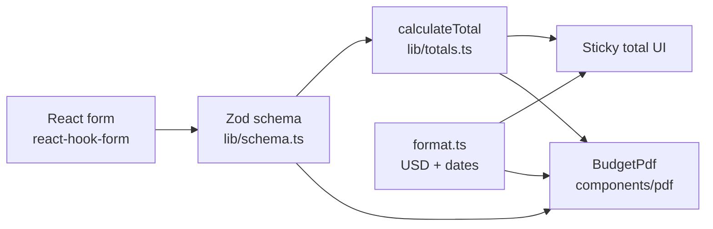

# Architecture — Travel Budget

## Overview

Travel Budget is a client-only React app. Operators fill a form in the browser; validated data drives a PDF quote generated with `@react-pdf/renderer`. There is no backend in v1.

## Data flow

1. **Form** — `react-hook-form` with `zodResolver`; UI labels and validation messages in Spanish.
2. **Schema** — Single source of truth; types via `z.infer<typeof budgetSchema>`.
3. **Totals** — Pure functions in `lib/totals.ts` (sum optional USD prices).
4. **Format** — `lib/format.ts` for currency (`en-US`) and dates.
5. **PDF** — `components/pdf/` renders only sections that have content; total shown when enabled and prices exist.

## Folder layout

| Path | Role |
|------|------|
| `src/components/ui/` | shadcn/ui primitives |
| `src/components/form/` | Form sections (header, flights, hotels, …) |
| `src/components/pdf/` | PDF template |
| `src/lib/` | Domain logic: schema, totals, format (no JSX) |
| `docs/` | Plans and architecture |

## Quality gates

- `pnpm validate` — ESLint, TypeScript, Vitest, production build.
- Unit tests target pure `lib/` modules; component tests cover critical form behavior.

## Out of scope (v1)

Backend, database, auth, branding assets, multi-currency.
