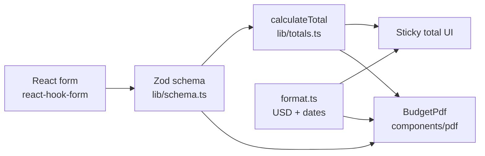

# Architecture — Travel Budget

## Overview

Travel Budget is a client-only React app. Operators fill a form in the browser; validated data drives a PDF quote generated with `@react-pdf/renderer`. There is no backend in v1.

## Data flow

1. **Form** — `react-hook-form` with `zodResolver`; UI labels and validation messages in Spanish.
2. **Schema** — Single source of truth; types via `z.infer<typeof budgetSchema>`.
3. **Totals** — Pure functions in `lib/totals.ts` (sum optional USD prices).
4. **Format** — `lib/format.ts` for currency (`en-US`) and dates.
5. **PDF** — `components/pdf/` renders only sections that have content; optional “Información adicional” from the header when filled; fixed price disclaimer from `lib/quote-copy.ts` on every export; footer total when `showTotalInPdf` and sum &gt; 0; line prices omitted when `hideIndividualPricesInPdf` is on (total still uses them). Optional agency logo resolved at generation time via `resolvePdfLogo()` in `lib/pdf-helpers.ts`.

## Content Security Policy

`@react-pdf/renderer` uses the Yoga layout engine (WebAssembly). In-browser PDF generation requires:

- `script-src 'unsafe-eval' 'wasm-unsafe-eval'` — WASM compilation
- `connect-src data:` — Yoga ships its WASM as a `data:` URI
- `frame-src blob:` — PDF preview embeds a `blob:` URL in an `<iframe>`

Configured in `src/lib/csp.ts` for production/preview builds and deploy headers (`vercel.json`, `public/_headers`). **Dev server sends no CSP header** so local testing is not restricted.

If PDF generation fails inside Cursor’s embedded browser preview, open the app in **Chrome or Edge** — the IDE preview may apply a stricter CSP that cannot be overridden by the app.

## Folder layout

| Path | Role |
|------|------|
| `src/components/ui/` | shadcn/ui primitives |
| `src/components/form/` | Form sections (header, flights, hotels, excursions, transfers, car rentals, travel assistance, PDF branding) |
| `src/components/pdf/` | PDF template and styles (`pdf-styles.ts`) |
| `src/lib/` | Domain logic: schema, totals, format, draft, pdf-helpers, agency logo, theme, CSP (no JSX) |
| `docs/` | Plans and architecture |

## Quality gates

- `pnpm validate` — ESLint, TypeScript, Vitest, production build.
- Unit tests target pure `lib/` modules; component tests cover critical form behavior.

## Out of scope (v1)

Backend, database, auth, multi-currency. **Branding:** optional agency logo on PDF is in scope (global storage in `src/lib/agency-logo.ts`, toggle `includeLogoInPdf` in draft v1). Full brand kit (agency name, colors in form/PDF) remains v2.
