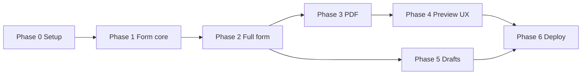

# Implementation Plan — Travel Budget PDF

Build travel quotes/itineraries from a form and export a client-ready PDF. The repo is a **portfolio-quality** project: small scope, high engineering bar (tests, lint, typed code, English docs).

---

## Agreed stack

| Layer | Technology |
|-------|------------|
| Package manager | **pnpm** |
| Build | Vite + React + TypeScript (strict) |
| UI | shadcn/ui + Tailwind CSS |
| Forms | react-hook-form + zod |
| PDF | @react-pdf/renderer |
| Dates | date-fns + Calendar (shadcn) |
| Tests | **Vitest** + Testing Library |
| Quality | ESLint + Prettier + `pnpm validate` |
| Deploy | Vercel or Netlify (static) |

**Out of scope v1:** Next.js, backend, database, auth, final brand/logo.

---

## Language & conventions

| Area | Language |
|------|----------|
| README, `docs/`, comments (when needed), commit messages | **English** |
| Code (components, functions, types, file names) | **English** |
| End-user UI (labels, validation messages, PDF copy) | **Spanish** (operators are Spanish-speaking) |

---

## Design decisions (closed)

| Topic | Decision |
|-------|----------|
| Flights & hotels | **Optional.** All dynamic sections start **empty**. User adds items only when needed. Minimum count per section: **0**. |
| Excursions & transfers | Empty by default (unchanged). |
| Empty PDF | Valid if header is filled (destination, dates, passengers). Section blocks render only when they have items (or travel assistance is enabled). |
| Prices | Optional per line item. Empty = not included in total. `0` is allowed but treated as explicit zero if entered. |
| Total in PDF | Shown only when `showTotalInPdf` is on **and** at least one price exists. |
| PDF export | Requires **valid form** (`trigger()` / full Zod parse) before generate/download. |
| Header dates | `dateFrom <= dateTo`; both required for submit. |
| Passengers | Positive integer, min 1, reasonable max (e.g. 99). |
| Hotels | Either date range **or** night count required **per hotel row** when that row exists (not both mandatory globally). |
| Drafts (`localStorage`) | Key includes schema version: `travel-budget-draft-v1`. Incompatible drafts → offer discard. |
| Package scripts | `pnpm dev`, `pnpm build`, `pnpm test`, `pnpm lint`, `pnpm validate` (lint + typecheck + test + build). |

---

## Functional requirements (summary)

- Header: destination, date from/to, passenger count.
- Sections: Flights, Hotels, Excursions/Tickets, Transfer, Travel assistance.
- **Dynamic arrays:** all sections start empty; add/remove freely down to zero items.
- Prices in **USD**, optional per item.
- **Estimated total** computed automatically; toggle to show/hide on PDF.
- Fixed PDF template, professional layout (no brand assets in v1).

---

## Portfolio quality bar

What reviewers should see on GitHub:

- [ ] **README (English):** what it does, screenshots/GIF, live URL, scripts table, tech stack.
- [ ] **`docs/`:** this plan + short `ARCHITECTURE.md` (data flow: form → schema → totals → PDF).
- [ ] **Strict TypeScript** — types inferred from Zod (`z.infer<typeof budgetSchema>`).
- [ ] **Unit tests** for pure logic (`totals`, `format`, schema edge cases).
- [ ] **Component tests** for critical form behavior (add/remove row, validation messages).
- [ ] **ESLint + Prettier** — consistent with your other projects; no disabled rules without comment.
- [ ] **`pnpm validate`** passes locally and in CI (GitHub Actions optional but recommended).
- [ ] **Sensible folder structure** — UI vs domain logic separated (`lib/` not bloated with JSX).
- [ ] **No `any`**, minimal `eslint-disable`.

---

## Phases

### Phase 0 — Project setup & quality baseline
**Goal:** Repo ready to develop with pnpm, lint, test, and English docs skeleton.

**Tasks:**
- [ ] Scaffold Vite (`react-ts`) with **pnpm**.
- [ ] Tailwind + shadcn/ui (Button, Input, Label, Card, Separator, Checkbox, Select, Textarea, Calendar, Popover).
- [ ] Dependencies: `react-hook-form`, `@hookform/resolvers`, `zod`, `@react-pdf/renderer`, `date-fns`.
- [ ] Dev deps: `vitest`, `@testing-library/react`, `@testing-library/jest-dom`, `jsdom`, ESLint, Prettier.
- [ ] Folder structure:
  ```
  src/
    components/ui/          # shadcn
    components/form/        # form sections
    components/pdf/         # PDF template
    lib/
      schema.ts             # Zod schemas
      schema.test.ts
      format.ts             # USD, dates
      format.test.ts
      totals.ts
      totals.test.ts
    App.tsx
  docs/
    IMPLEMENTATION-PLAN.md
    ARCHITECTURE.md
  ```
- [ ] `package.json` scripts: `dev`, `build`, `test`, `test:watch`, `lint`, `typecheck`, **`validate`**.
- [ ] **README.md (English):** prerequisites, install, dev, test, build, project purpose.
- [ ] `.github/workflows/ci.yml` (optional): `pnpm validate` on push/PR.
- [ ] `LICENSE` if public repo (MIT typical).

**Done when:** `pnpm dev` runs; `pnpm validate` passes (smoke test + empty build); shadcn renders.

**Estimate:** ~3–5 h

---

### Phase 1 — Data model & form (header + flights + hotels)
**Goal:** Core form with optional flights/hotels arrays.

**Tasks:**
- [ ] Zod schemas in `lib/schema.ts` (`Budget`, `Flight`, `Hotel`, nested `Layover`, etc.).
- [ ] **Default values:** all arrays **empty**; sensible empty header defaults.
- [ ] Header UI: destination, date from/to, passengers.
- [ ] **Flights** (`useFieldArray`, starts empty):
  - route, duration, description;
  - type: direct | layovers;
  - if layovers: nested dynamic array (where + duration);
  - optional USD price;
  - add / remove — **minimum 0 flights**.
- [ ] **Hotels** (`useFieldArray`, starts empty):
  - name;
  - date from/to **or** night count (at least one per row when filled);
  - room type: standard | double | triple | luxury;
  - breakfast yes/no, all inclusive;
  - optional USD price;
  - add / remove — **minimum 0 hotels**.
- [ ] Validation on submit — **messages in Spanish** (UI).
- [ ] Responsive layout: cards per section, clear headings.
- [ ] **Tests:** `schema.test.ts` (valid/invalid payloads, empty arrays, date rules); optional test for default form values.

**Done when:** Budget with 0 flights / 0 hotels submits; budget with 2 flights + 3 hotels validates; errors visible; `pnpm test` green.

**Estimate:** ~1.5–2.5 days

---

### Phase 2 — Remaining form + live totals
**Goal:** Full form per wireframe; total updates in UI.

**Tasks:**
- [ ] **Excursions / Tickets** (empty by default): name, description, optional price.
- [ ] **Transfer** (empty by default): from, to, description, optional price.
- [ ] **Travel assistance** (optional): include checkbox; description + price when enabled.
- [ ] `calculateTotal()` in `lib/totals.ts` — sum defined positive prices only.
- [ ] Sticky bar/card: **Total estimado: USD X,XXX.XX** (`en-US` formatting).
- [ ] Checkbox **“Mostrar total en el PDF”** (default on).
- [ ] Price inputs: USD prefix/suffix; positive numbers only.
- [ ] **Tests:** `totals.test.ts` — empty, partial prices, assistance on/off, decimals; `format.test.ts` for currency.

**Done when:** All sections exist; total updates live; tests cover edge cases.

**Estimate:** ~1 day

---

### Phase 3 — PDF template & download
**Goal:** Generate and download PDF from validated data.

**Tasks:**
- [ ] Register sans font (e.g. Inter) for `@react-pdf/renderer`.
- [ ] `BudgetPdf` component — accepts parsed `Budget` type.
- [ ] PDF layout:
  - Header: destination, dates, passengers.
  - Section blocks **only if items exist** (or assistance enabled).
  - Per item: details + right-aligned price when present.
  - Flights: Direct vs layover list.
  - Hotels: nights or date range, room type, breakfast, all inclusive.
  - Footer total only if `showTotalInPdf` && sum > 0.
- [ ] Styles: sober palette (e.g. `#1e3a5f` headings), A4 margins.
- [ ] **Download PDF** — validate form first; `pdf()` → blob → `quote-{destination}-{date}.pdf`.
- [ ] Error handling if generation fails (user-facing Spanish message).
- [ ] **Tests:** pure helpers for “section has content” / filename slug (if extracted); manual checklist in `docs/` for visual PDF QA.

**Done when:** Valid form → download → PDF matches input; empty sections omitted.

**Estimate:** ~1.5–2 days

---

### Phase 4 — Preview & UX polish
**Goal:** Preview before download; daily-use polish.

**Tasks:**
- [ ] Embedded preview (`PDFViewer` or blob in modal/iframe).
- [ ] Clear actions: Preview | Download.
- [ ] Confirm before removing a row with data.
- [ ] Empty states (Spanish): e.g. “Sin vuelos — agregar si corresponde”.
- [ ] Accessibility from the start: labels, focus order, contrast.
- [ ] Mobile pass on form + preview fallback (download-only if preview heavy).
- [ ] **Tests:** one RTL test for a small form section (e.g. add flight row) if stable.

**Done when:** PDF reviewable on screen without downloading first.

**Estimate:** ~0.5–1 day

---

### Phase 5 — Local drafts (recommended)
**Goal:** Survive browser close without losing work.

**Tasks:**
- [ ] Persist form to `localStorage` (debounce ~500 ms).
- [ ] On load: prompt to restore draft if present (Spanish UI).
- [ ] “Nuevo presupuesto” / clear form.
- [ ] (Optional) Export/import JSON backup.
- [ ] **Tests:** serialize/deserialize round-trip with version key (pure functions in `lib/draft.ts`).

**Done when:** Close tab → reopen → data restored; `pnpm validate` still passes.

**Estimate:** ~0.5 day

---

### Phase 6 — Deploy & handoff
**Goal:** Public URL for real use.

**Tasks:**
- [ ] `pnpm build` clean.
- [ ] Deploy Vercel/Netlify from GitHub.
- [ ] Smoke test PDF in production (Chrome, Edge, Firefox if possible).
- [ ] README: live URL + **short Spanish “how to use”** section for operators.
- [ ] Ensure CI runs `pnpm validate` on main.

**Done when:** Stable public URL; PDF works like local.

**Estimate:** ~2–4 h

---

## Phase 7+ — Backlog (post-MVP)

| Item | Description |
|------|-------------|
| Brand | Logo, agency name, colors in PDF and form |
| Templates | PDF variants (with/without prices, itinerary-only) |
| Duplicate quote | Clone data for another client |
| History | Needs backend + auth |
| Multi-currency | ARS + USD |
| Print | `window.print()` on preview |
| Section subtotals | Subtotal flights, hotels, etc. |
| Legal footer | “Prices subject to change” |

---

## Phase dependencies



Recommended solo order: **F0 → F1 → F2 → F3 → F4 → F5 → F6** (do not parallelize drafts with preview until schema is stable).

---

## Risks & mitigations

| Risk | Mitigation |
|------|------------|
| PDF layout mismatch | Iterate Phase 3 with real sample; keep snapshot checklist in `docs/` |
| react-pdf CSS limits | Simple flexbox; avoid Grid |
| Long form overwhelm | Collapsible cards in Phase 4 |
| Data loss | Phase 5 + versioned draft key |
| Nested `useFieldArray` (layovers) | Spike in Phase 1; tests for schema; keep nesting shallow |
| Safari / mobile PDF | Test in Phase 6; preview fallback |
| Portfolio scope creep | Quality bar is about **discipline**, not extra features — resist backlog until MVP ships |

---

## MVP definition

- [ ] Full form (all sections, all optional except header rules).
- [ ] Zero or many flights/hotels per quote.
- [ ] USD prices + optional total on PDF.
- [ ] Professional downloadable PDF.
- [ ] `pnpm validate` green; README + architecture doc in English.
- [ ] Public deploy URL.

**Total estimate (one person):** ~6–9 focused days (includes tests and docs).

---

## Immediate next step

**Phase 0:** Scaffold `travel-budget` with pnpm, Vite, shadcn, Vitest, ESLint/Prettier, English README, and `pnpm validate`.
